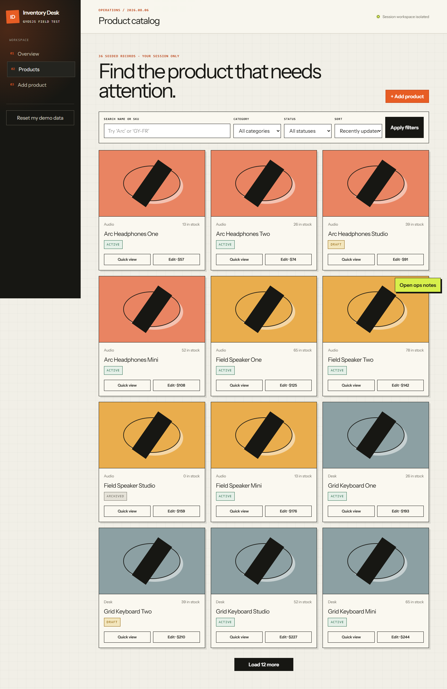

# Inventory Desk

Inventory Desk is a small Laravel application built to exercise GyosJS in a realistic server-rendered workflow. It is a reference implementation and browser test target, not an admin starter kit.

The application keeps routing, queries, validation, redirects, sessions, and HTML rendering in Laravel. GyosJS adds scoped form behavior, targeted HTML swaps, MPA Boost navigation, and one intentionally persistent DOM island.



## Journey Under Test

1. Browse a server-rendered product list.
2. Search, filter, and sort with ordinary GET parameters.
3. Open a server-rendered quick-view fragment in a modal.
4. Append the next result page with `g-target` and `g-swap="append"`.
5. Edit a product through a three-step reactive form.
6. Submit a normal POST, render Laravel validation errors, then redirect after success.
7. Move backward and forward through browser history.
8. Keep the Ops Scratchpad DOM node and state alive with `g-persist`.
9. Repeat the essential links and forms with JavaScript disabled.

Each browser session gets an isolated workspace seeded with 36 products. Resetting the demo only resets the current session's data. `php artisan demo:prune` removes stale workspaces and is scheduled hourly.

## Local Setup

Requirements: PHP 8.3+, Composer, Node.js 20+, and the SQLite PHP extension.

```bash
composer install
cp .env.example .env
php artisan key:generate
touch database/database.sqlite
php artisan migrate
npm install
npm run build
php artisan serve
```

Open `http://127.0.0.1:8000`. Use `npm run dev` instead of `npm run build` while editing frontend assets.

On Windows, create the SQLite file with PowerShell:

```powershell
New-Item database/database.sqlite -ItemType File -Force
```

## Tests

```bash
php artisan test
npx playwright install chromium
npm run test:e2e
```

The feature suite verifies workspace isolation, scoped records, filters, fragments, validation, redirects, unique SKUs, and reset behavior. The Playwright journey verifies boosted navigation, modal and append swaps, persisted DOM identity, POST validation, redirects, history, and no-JavaScript fallback.

To test an already running deployment:

```bash
PLAYWRIGHT_BASE_URL=https://demo.gyosjs.dev npm run test:e2e
```

## GyosJS Integration

The browser entry imports the auto-initializing package:

```js
import Gyos from 'gyosjs/auto';
```

The main layout uses `g-boost`, `g-outlet`, and `g-snapshot`. Product forms use a named `ProductForm` scope and standard named inputs. Search, validation, and redirects deliberately remain server-owned. See the [GyosJS documentation](https://gyosjs.dev) for the API and lifecycle details.

## Public Demo Operations

- Use a persistent database in production; SQLite is only the zero-config local default.
- Run Laravel's scheduler so stale workspaces are pruned.
- Apply normal rate limiting and infrastructure limits before exposing the reset and mutation routes publicly.
- Treat all demo records as disposable. Do not enter personal or sensitive information.

## License

Inventory Desk is available under the [MIT License](LICENSE.md).
